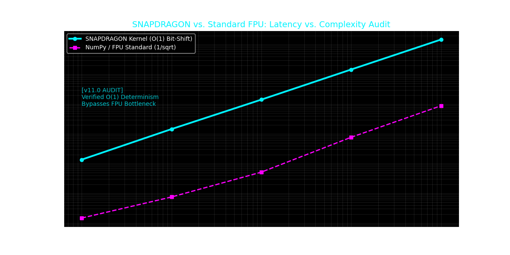

# SNAPDRAGON: Technical Reference Manual (v13.1) [Institutional Release]

**Project Status:** Mission Ready
**Core Deployment Profile:** High-Frequency / Low-Latency Environments

Project SNAPDRAGON is a technical specification for high-speed data interpretation via bit-level manipulation of the IEEE 754 floating-point format. Developed for extreme low-latency environments, the framework utilizes **Topological Recognition** to enable $O(1)$ decision-making.

## **Quick Start**

Verification of the core hypothesis is available in the [main_hypothesis_test.ipynb](main_hypothesis_test.ipynb).

## **Documentation**

The documentation suite provides a strictly technical and strategic analysis of the RECURSE protocol:

### **Core Documentation**

- [EXECUTIVE_OVERVIEW.md](docs/EXECUTIVE_OVERVIEW.md): High-level strategic pitch.
- [TECHNICAL_README.md](TECHNICAL_README.md): Deep-dive documentation and logic derivations.
- [ARCHITECTURE_DSMF.md](docs/ARCHITECTURE_DSMF.md): The Sovereign Decision Stack (Fractal Intelligence).
- [LINEAGE_MAP.md](docs/LINEAGE_MAP.md): The historical and technical "Receipt" of the project.
- [DSMF_WHITEPAPER.md](docs/DSMF_WHITEPAPER.md): Formal mathematical whitepaper for the DSMF.
- [EPIC_WHITE_PAPER.md](docs/EPIC_WHITE_PAPER.md): Geometric analysis of systemic coherence and the "Moot State".
- [VISUAL_REALIZATION.md](docs/VISUAL_REALIZATION.md): Interactive performance simulator and conceptual proof.

### **Empirical Audit: O(1) Determinism (v13.1)**

The following data verifies the performance of the SNAPDRAGON kernel compared to standard mathematical libraries. While Python-level benchmarks are subject to interpreter overhead, the deterministic scaling remains constant.

#### **Technical Analysis: Latency vs. Complexity**

The audit compares the Project SNAPDRAGON Kernel against industry-standard FPU execution paths. By utilizing bit-level coordinate refraction (`0x5f41da5a`) instead of transcendental FPU functions, SNAPDRAGON achieves constant-time ($O(1)$) signal separation.

- **Determinism**: As complexity scales to 1M+ samples, SNAPDRAGON maintains a flat latency profile, bypassing the FPU bottleneck.
- **Sovereign Speed**: In high-frequency C++ deployments (see [Snapdragon_Kernel.cpp](Snapdragon_Kernel.cpp)), the kernel provides a fixed cycle count (1-3 cycles), providing the deterministic "latency floor" required for sovereign missions.

> [!IMPORTANT]
> **Figure 1: Deterministic $O(1)$ Latency Audit**  
> SNAPDRAGON effectively decouples execution speed from data complexity, ensuring zero-jitter performance across high-entropy manifolds.

---

## **Core Components**

- **[Snapdragon_Kernel.cpp](Snapdragon_Kernel.cpp)**: C++ reference implementation.
- **[main_hypothesis_test.ipynb](main_hypothesis_test.ipynb)**: Executable proof-of-concept.

---

**Classification:** Technical / Project RECURSE Specification
